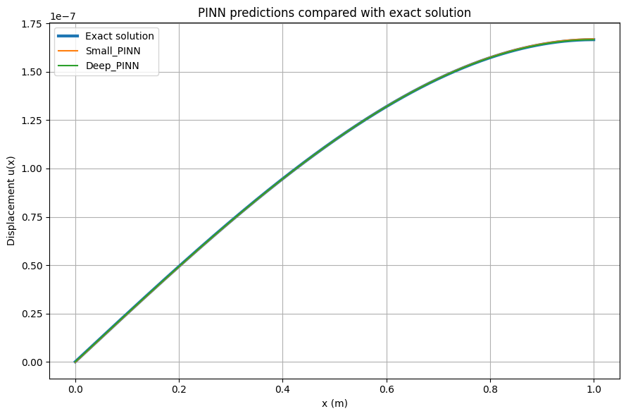
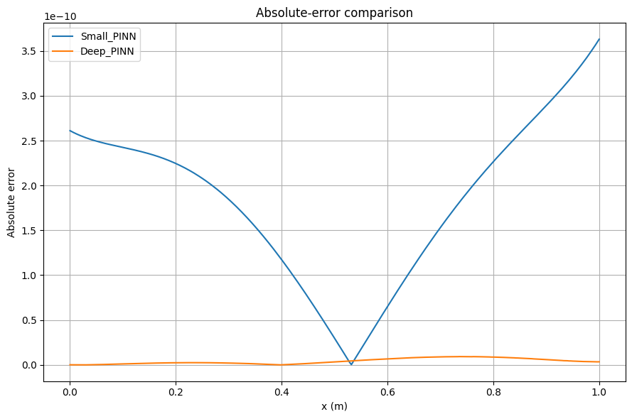
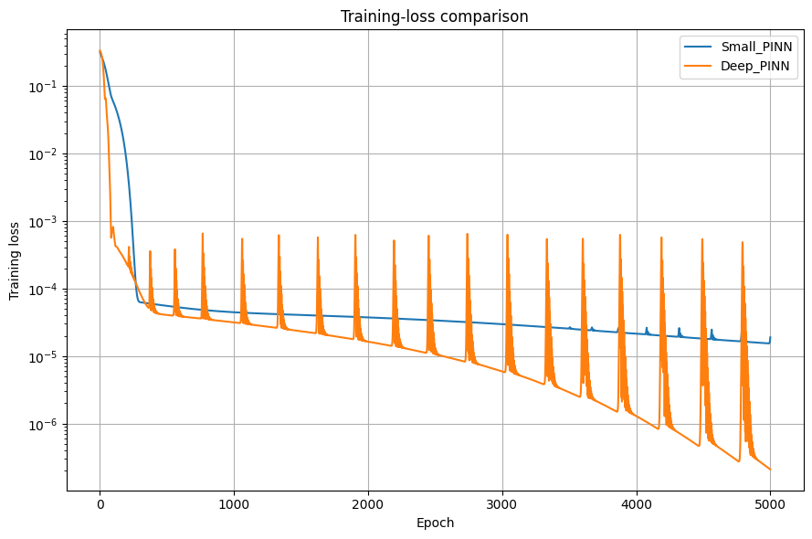
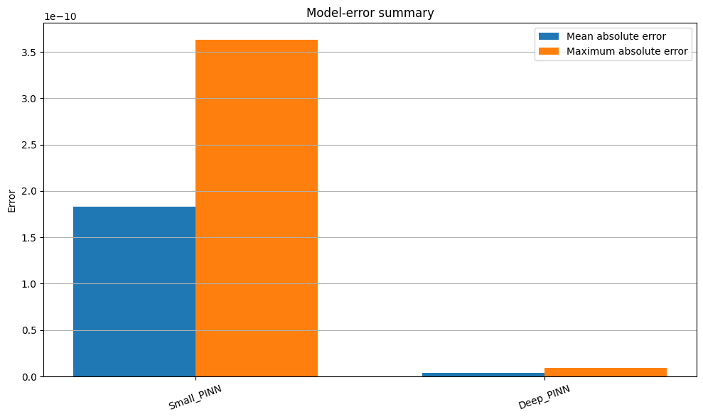

# Physics-Informed Neural Network Model Comparison

An object-oriented Python project for training and comparing physics-informed neural networks (PINNs) for a one-dimensional boundary-value problem.

The program allows users to configure and compare multiple neural-network architectures by specifying parameters such as the number of hidden layers, neurons per layer, activation function, learning rate, and number of training epochs.

The trained PINNs are evaluated against the analytical solution, and the program produces numerical summaries and graphical comparisons of their performance.

## Physical Problem

The project considers a one-dimensional elastic rod of length $L$ subjected to a linearly distributed load.

The displacement $u\(x\)$ satisfies

$$
AEu\'\'\(x\) \+ cx \= 0\,
$$

with boundary conditions

$$
u\(0\) \= 0\,
$$

and

$$
u\'\(L\) \= 0\,
$$

where:

- $E$ is Young's modulus,
- $A$ is the cross-sectional area,
- $c$ is the load coefficient,
- $L$ is the length of the rod.

The analytical solution is

$$
u\(x\)
\=
\\frac\{c\}\{6AE\}
\\left\(
\-x\^3 \+ 3L\^2x
\\right\)\.
$$

## Nondimensionalisation

Direct training with the physical parameters leads to quantities on very different numerical scales. To obtain a better-conditioned PINN problem, the differential equation is nondimensionalised.

Using

$$
\\xi \= \\frac\{x\}\{L\}
$$

and the characteristic displacement scale

$$
U \= \\frac\{cL\^3\}\{AE\}\,
$$

the physical displacement is written as

$$
u\(x\) \= Uv\(\\xi\)\.
$$

The dimensionless problem becomes

$$
v\'\'\(\\xi\) \+ \\xi \= 0\,
$$

with

$$
v\(0\)\=0\,
\\qquad
v\'\(1\)\=0\.
$$

Its analytical solution is

$$
v\(\\xi\)
\=
\\frac\{\-\\xi\^3 \+ 3\\xi\}\{6\}\.
$$

The neural networks are trained on this dimensionless formulation, while predictions are converted back to physical displacement values for evaluation and visualization.

## Features

- Object-oriented implementation
- User-configurable neural-network architectures
- Comparison of multiple PINN models
- TensorFlow automatic differentiation
- Physics-informed PDE residual loss
- Boundary-condition losses
- Nondimensionalised training problem
- Analytical reference solution
- Mean and maximum absolute-error evaluation
- Training-loss comparison
- Graphical comparison of predicted and exact solutions

Supported activation functions are:

- `tanh`
- `sigmoid`
- `swish`
- `softplus`

## Project Structure

```text
.
├── main.py
├── rod_problem.py
├── pinn_configuration.py
├── pinn_model.py
├── model_comparison.py
├── user_input.py
├── requirements.txt
└── README.md
```

### `rod_problem.py`

Defines the physical rod problem, its nondimensionalisation, displacement scale, and analytical solution.

### `pinn_configuration.py`

Stores and validates the hyperparameters of individual PINN models.

### `pinn_model.py`

Constructs and trains individual PINNs using TensorFlow. It calculates the PDE and boundary-condition losses using automatic differentiation and evaluates predictions against the analytical solution.

### `model_comparison.py`

Trains, evaluates, and visualizes multiple PINN models and provides numerical comparisons of their performance.

### `user_input.py`

Handles interactive user input and creates validated model configurations.

### `main.py`

Provides the entry point for the program and coordinates model construction, training, evaluation, and visualization.

## Installation

Clone the repository and install the required packages:

```bash
pip install -r requirements.txt
```

## Usage

Run:

```bash
python main.py
```

The program interactively asks how many models should be compared and requests the configuration of each model.

For every model, the user can specify:

- model name,
- number of hidden layers,
- neurons per hidden layer,
- activation function,
- learning rate,
- number of training epochs.

For example:

```text
How many models do you want to compare? 2

Configuration for model 1
Model name [Model 1]: Small_PINN
Number of hidden layers: 2
Neurons per hidden layer: 20
Activation function (tanh, sigmoid, swish, softplus): swish
Learning rate, for example 0.001: 0.001
Number of epochs: 5000

Configuration for model 2
Model name [Model 2]: Deep_PINN
Number of hidden layers: 4
Neurons per hidden layer: 40
Activation function (tanh, sigmoid, swish, softplus): swish
Learning rate, for example 0.001: 0.001
Number of epochs: 5000
```

## Output

After training, the program reports a numerical comparison including:

- number of hidden layers,
- neurons per layer,
- number of trainable parameters,
- final training loss,
- mean absolute error,
- maximum absolute error.

It also produces four graphical comparisons:

1. PINN predictions and the analytical solution,
2. pointwise absolute errors,
3. training-loss histories,
4. mean and maximum absolute-error summary.

## Example Results

An example comparison between a smaller and a deeper PINN shows that both architectures can closely approximate the analytical displacement solution after nondimensionalisation.

Despite having substantially fewer trainable parameters, the smaller network can achieve accuracy comparable to the deeper architecture, illustrating that increasing network complexity does not necessarily improve performance for this relatively simple boundary-value problem.

## Technologies

- Python
- TensorFlow / Keras
- NumPy
- Matplotlib

## Purpose

This project explores the application of physics-informed neural networks to differential equations while providing a flexible framework for studying how neural-network architecture and training parameters affect approximation accuracy and convergence behaviour.

## Example Results

### PINN Predictions

The trained PINN models are compared with the analytical solution.



### Absolute Error

The point wise absolute errors show the approximation accuracy of the different network architectures.


### Training Loss

The training-loss histories illustrate the convergence behaviour of the models.


### Error Summary

Mean and maximum absolute errors provide a quantitative comparison of the trained models.


